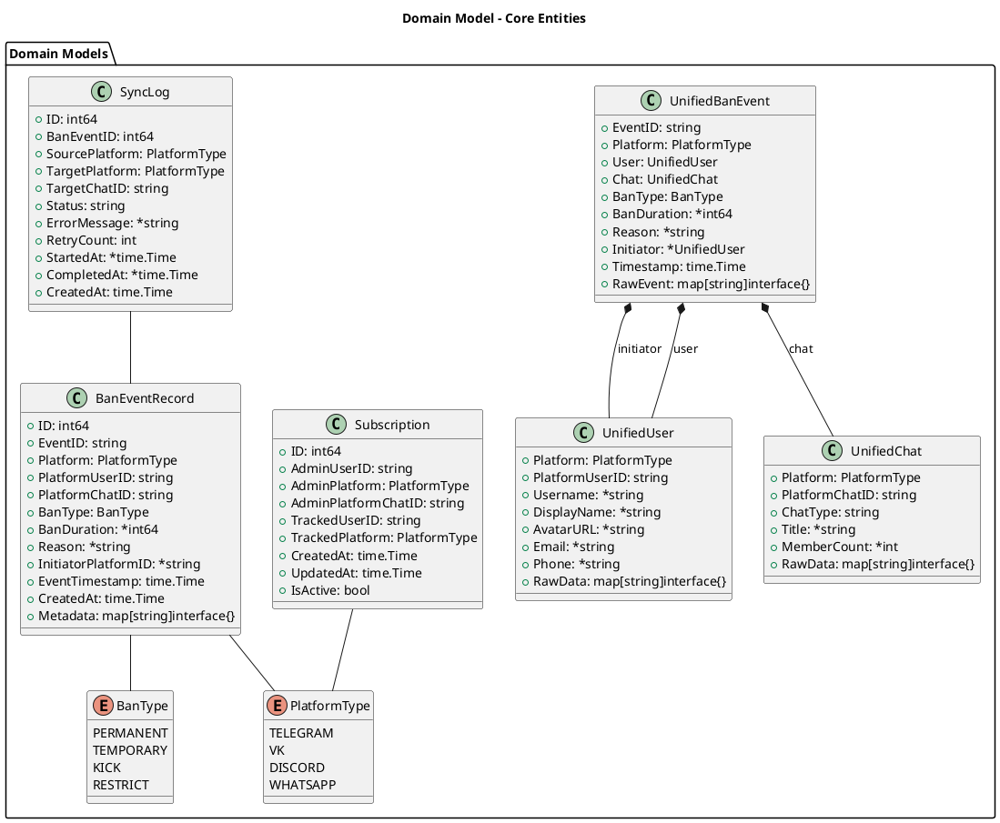
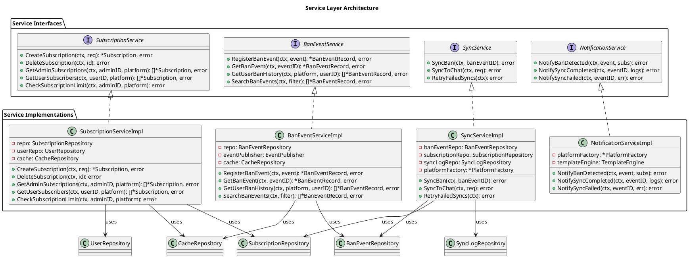
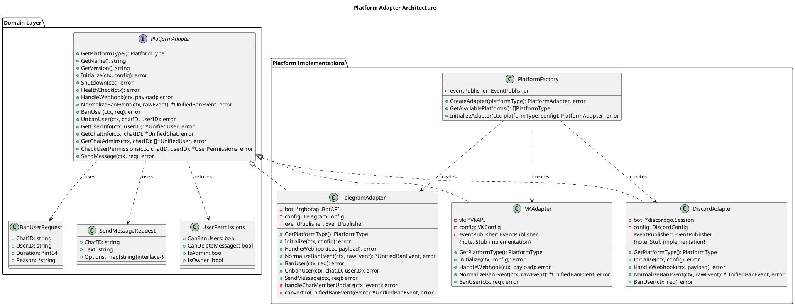
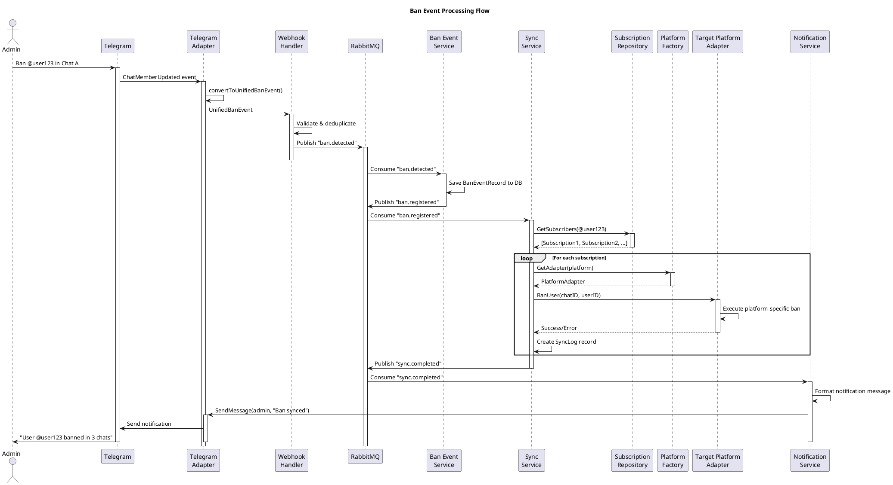
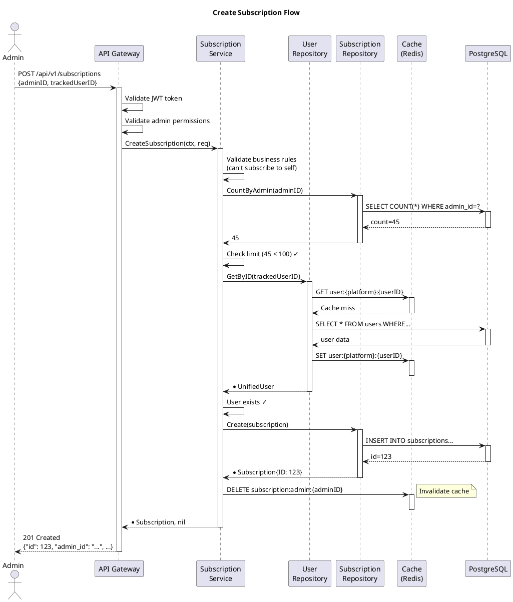
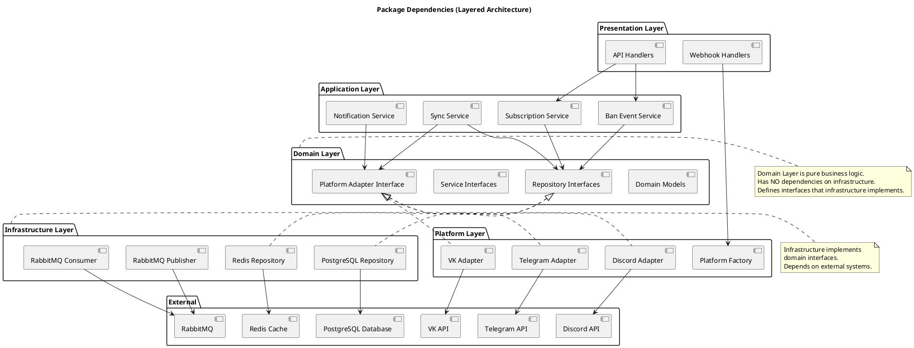
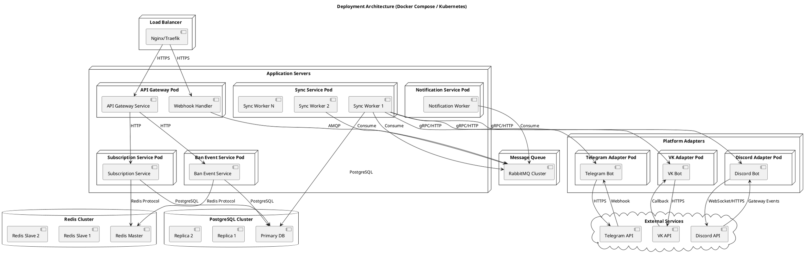
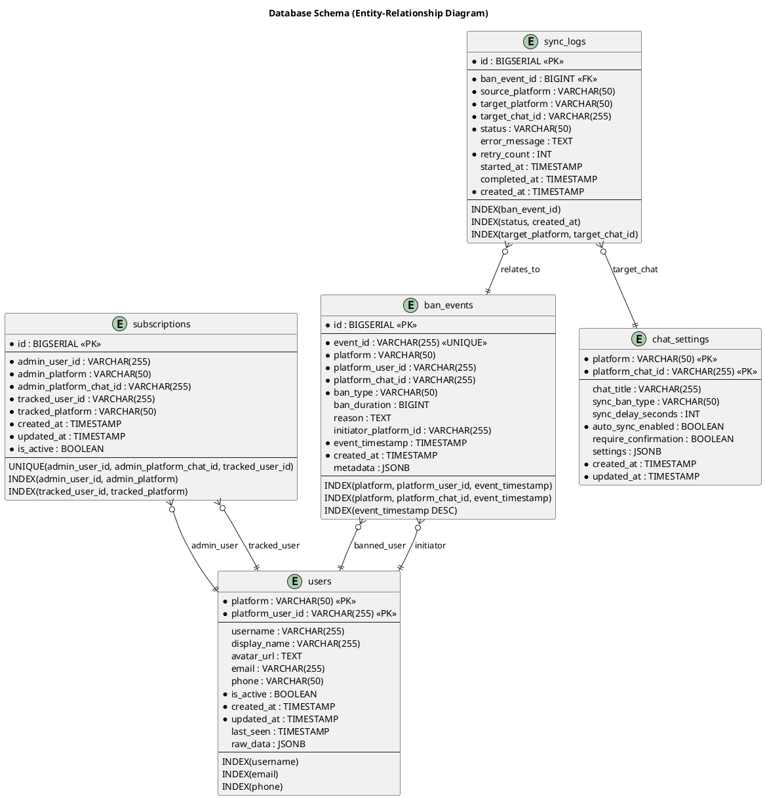

# UML диаграммы архитектуры сервиса

## 1. High-Level Architecture (Component Diagram)

```plantuml
@startuml
!include https://raw.githubusercontent.com/plantuml-stdlib/C4-PlantUML/master/C4_Component.puml

LAYOUT_WITH_LEGEND()

title High-Level System Architecture

Person(admin, "Administrator", "Community moderator")
Person(user, "User", "Platform user")

System_Boundary(external, "External Systems") {
    System_Ext(telegram, "Telegram API", "Bot API")
    System_Ext(vk, "VK API", "Callback API")
    System_Ext(discord, "Discord API", "Gateway/REST")
}

System_Boundary(adapters, "Platform Adapters Layer") {
    Component(tg_adapter, "Telegram Adapter", "Go", "Handles Telegram events")
    Component(vk_adapter, "VK Adapter", "Go", "Handles VK events (stub)")
    Component(dc_adapter, "Discord Adapter", "Go", "Handles Discord events (stub)")
}

System_Boundary(gateway, "API Gateway") {
    Component(api_gw, "API Gateway", "Go/Gin", "Routes requests, validates tokens")
    Component(webhook_handler, "Webhook Handler", "Go", "Processes platform webhooks")
}

System_Boundary(core, "Core Services") {
    Component(sub_service, "Subscription Service", "Go", "Manages subscriptions")
    Component(user_service, "User Service", "Go", "Manages users")
    Component(ban_service, "Ban Event Service", "Go", "Tracks ban events")
    Component(sync_service, "Sync Service", "Go", "Syncs bans across platforms")
    Component(notif_service, "Notification Service", "Go", "Sends notifications")
}

System_Boundary(infra, "Infrastructure") {
    ContainerDb(postgres, "PostgreSQL", "Database", "Stores subscriptions, bans, users")
    ContainerDb(redis, "Redis", "Cache", "Caches user data, deduplication")
    Container(rabbitmq, "RabbitMQ", "Message Queue", "Event-driven communication")
}

Rel(admin, api_gw, "Uses", "HTTPS/REST")
Rel(user, telegram, "Banned in", "")

Rel(telegram, tg_adapter, "Sends events", "Webhook")
Rel(vk, vk_adapter, "Sends events", "Callback")
Rel(discord, dc_adapter, "Sends events", "Gateway")

Rel(tg_adapter, webhook_handler, "Normalized events", "")
Rel(vk_adapter, webhook_handler, "Normalized events", "")
Rel(dc_adapter, webhook_handler, "Normalized events", "")

Rel(webhook_handler, rabbitmq, "Publishes", "ban.detected")
Rel(api_gw, sub_service, "API calls", "HTTP")
Rel(api_gw, user_service, "API calls", "HTTP")

Rel(rabbitmq, ban_service, "Consumes", "ban.detected")
Rel(rabbitmq, sync_service, "Consumes", "ban.detected")
Rel(rabbitmq, notif_service, "Consumes", "sync.completed")

Rel(sub_service, postgres, "Reads/Writes", "SQL")
Rel(ban_service, postgres, "Reads/Writes", "SQL")
Rel(user_service, postgres, "Reads/Writes", "SQL")
Rel(sync_service, postgres, "Reads/Writes", "SQL")

Rel(sub_service, redis, "Caches", "")
Rel(user_service, redis, "Caches", "")

Rel(sync_service, tg_adapter, "Bans user", "")
Rel(sync_service, vk_adapter, "Bans user", "")
Rel(sync_service, dc_adapter, "Bans user", "")

Rel(notif_service, tg_adapter, "Sends message", "")

@enduml
```

---

## 2. Domain Model (Class Diagram)



---

## 3. Repository Pattern (Class Diagram)

```plantuml
@startuml
title Repository Pattern Architecture

package "Domain Layer" <<Rectangle>> {
    interface SubscriptionRepository {
        +Create(ctx, sub): error
        +GetByID(ctx, id): *Subscription, error
        +Delete(ctx, id): error
        +GetByAdmin(ctx, adminID): []*Subscription, error
        +GetSubscribers(ctx, userID): []*Subscription, error
        +Exists(ctx, adminID, userID): bool, error
        +CountByAdmin(ctx, adminID): int64, error
    }
    
    interface BanEventRepository {
        +Create(ctx, event): error
        +GetByID(ctx, id): *BanEventRecord, error
        +GetByEventID(ctx, eventID): *BanEventRecord, error
        +GetUserHistory(ctx, platform, userID): []*BanEventRecord, error
        +GetChatHistory(ctx, platform, chatID): []*BanEventRecord, error
        +Search(ctx, filter): []*BanEventRecord, error
    }
    
    interface UserRepository {
        +Create(ctx, user): error
        +GetByID(ctx, platform, userID): *UnifiedUser, error
        +Update(ctx, user): error
        +Delete(ctx, platform, userID): error
        +List(ctx, filter): []*UnifiedUser, error
    }
    
    interface SyncLogRepository {
        +Create(ctx, log): error
        +Update(ctx, log): error
        +GetByID(ctx, id): *SyncLog, error
        +GetByBanEventID(ctx, eventID): []*SyncLog, error
        +GetFailedSyncs(ctx, maxRetry, limit): []*SyncLog, error
    }
    
    interface CacheRepository {
        +Set(ctx, key, value, ttl): error
        +Get(ctx, key, dest): error
        +Delete(ctx, key): error
        +Exists(ctx, key): bool, error
    }
}

package "Repository Implementation (PostgreSQL)" <<Database>> {
    class PostgresSubscriptionRepository {
        -db: *sql.DB
        +Create(ctx, sub): error
        +GetByID(ctx, id): *Subscription, error
        +Delete(ctx, id): error
        +GetByAdmin(ctx, adminID): []*Subscription, error
        +GetSubscribers(ctx, userID): []*Subscription, error
        +Exists(ctx, adminID, userID): bool, error
        +CountByAdmin(ctx, adminID): int64, error
    }
    
    class PostgresBanEventRepository {
        -db: *sql.DB
        +Create(ctx, event): error
        +GetByID(ctx, id): *BanEventRecord, error
        +GetByEventID(ctx, eventID): *BanEventRecord, error
        +GetUserHistory(ctx, platform, userID): []*BanEventRecord, error
        +GetChatHistory(ctx, platform, chatID): []*BanEventRecord, error
        +Search(ctx, filter): []*BanEventRecord, error
    }
    
    class PostgresUserRepository {
        -db: *sql.DB
        +Create(ctx, user): error
        +GetByID(ctx, platform, userID): *UnifiedUser, error
        +Update(ctx, user): error
        +Delete(ctx, platform, userID): error
        +List(ctx, filter): []*UnifiedUser, error
    }
    
    class PostgresSyncLogRepository {
        -db: *sql.DB
        +Create(ctx, log): error
        +Update(ctx, log): error
        +GetByID(ctx, id): *SyncLog, error
        +GetByBanEventID(ctx, eventID): []*SyncLog, error
        +GetFailedSyncs(ctx, maxRetry, limit): []*SyncLog, error
    }
}

package "Repository Implementation (Redis)" <<Database>> {
    class RedisCacheRepository {
        -client: *redis.Client
        +Set(ctx, key, value, ttl): error
        +Get(ctx, key, dest): error
        +Delete(ctx, key): error
        +Exists(ctx, key): bool, error
    }
}

SubscriptionRepository <|.. PostgresSubscriptionRepository
BanEventRepository <|.. PostgresBanEventRepository
UserRepository <|.. PostgresUserRepository
SyncLogRepository <|.. PostgresSyncLogRepository
CacheRepository <|.. RedisCacheRepository

@enduml
```



---

## 4. Service Layer (Class Diagram)



---

## 5. Platform Adapter Pattern (Class Diagram)



---

## 6. Sequence Diagram - Ban Event Flow



---

## 7. Sequence Diagram - Create Subscription Flow



---

## 8. Package Dependency Diagram



---

## 9. Deployment Diagram



---

## 10. Database Schema (ER Diagram)



---

## Как использовать эти диаграммы

### Для рендеринга PlantUML:

**Online:**
- http://www.plantuml.com/plantuml/uml/
- https://plantuml-editor.kkeisuke.com/

**VS Code:**
```bash
# Установите расширение
ext install jebbs.plantuml

# Или используйте CLI
brew install plantuml  # macOS
apt-get install plantuml  # Ubuntu

# Рендер


Нужны ли дополнительные диаграммы для каких-то специфических сценариев?