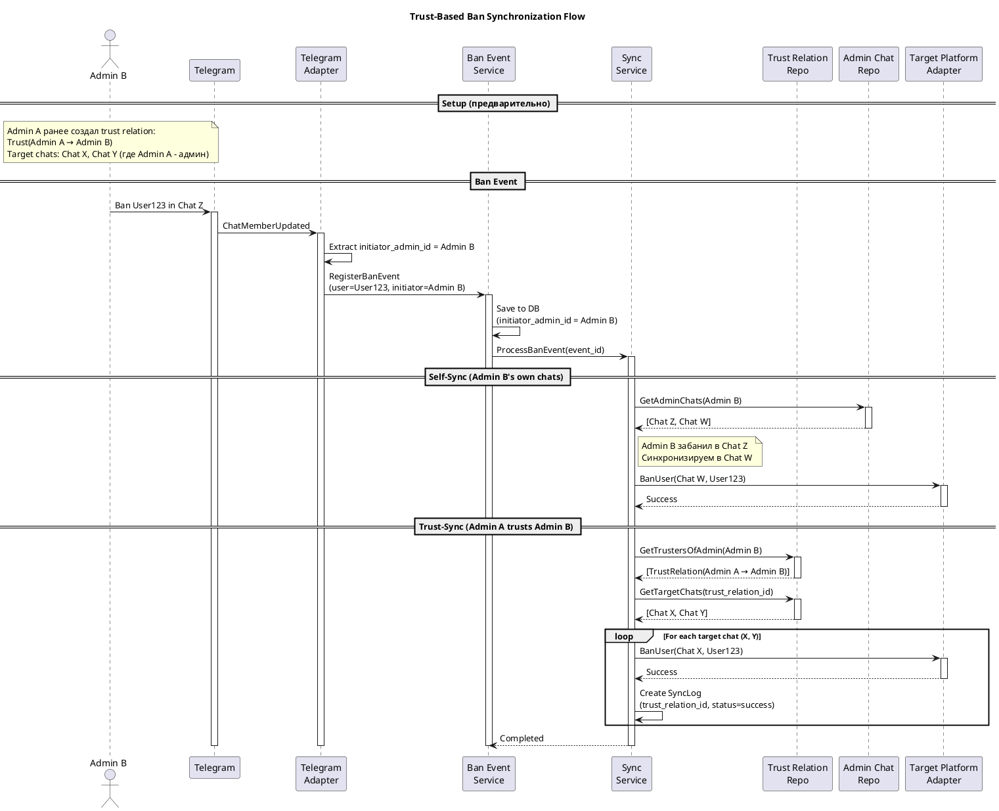

# Скорректированная архитектура - Trust-Based Ban System

Понял! Это **принципиально другая модель** - система доверия между модераторами, а не отслеживание конкретных пользователей.

---

## 🎯 Новая концепция

### Старая модель (была):
```
Admin A → подписка на User123 → если User123 забанен где-то → бан в чатах Admin A
```

### Новая модель (должна быть):
```
Admin A → доверяет Admin B (trust subscription)
Admin B → банит User123 в Chat X
→ User123 автоматически банится во ВСЕХ чатах где Admin A - администратор
```

**ИЛИ**

```
Admin A → банит User123 в Chat1
Admin A → также админ в Chat2, Chat3
→ User123 автоматически банится в Chat2 и Chat3
```

---

## 📊 Обновлённая доменная модель

### internal/domain/models.go - НОВАЯ ВЕРСИЯ

```go
package domain

import "time"

// TrustRelation - отношение доверия между администраторами
type TrustRelation struct {
    ID                  int64        `json:"id"`
    
    // Кто доверяет
    TrusterAdminID      string       `json:"truster_admin_id"`      // Admin A
    TrusterPlatform     PlatformType `json:"truster_platform"`
    
    // Кому доверяет
    TrustedAdminID      string       `json:"trusted_admin_id"`      // Admin B
    TrustedPlatform     PlatformType `json:"trusted_platform"`
    
    // В какие чаты применять баны
    TargetChats         []ChatTarget `json:"target_chats"`          // Пустой = все чаты truster'а
    
    // Настройки
    AutoSync            bool         `json:"auto_sync"`             // Автоматическая синхронизация
    SyncBanType         string       `json:"sync_ban_type"`         // "same", "permanent", "temporary"
    RequireConfirmation bool         `json:"require_confirmation"`  // Требовать подтверждения
    
    CreatedAt           time.Time    `json:"created_at"`
    UpdatedAt           time.Time    `json:"updated_at"`
    IsActive            bool         `json:"is_active"`
}

// ChatTarget - целевой чат для применения банов
type ChatTarget struct {
    Platform       PlatformType `json:"platform"`
    PlatformChatID string       `json:"platform_chat_id"`
}

// AdminChatRelation - связь администратора с чатом
type AdminChatRelation struct {
    ID             int64        `json:"id"`
    AdminID        string       `json:"admin_id"`
    Platform       PlatformType `json:"platform"`
    PlatformChatID string       `json:"platform_chat_id"`
    Role           string       `json:"role"`           // owner, admin, moderator
    CanBan         bool         `json:"can_ban"`
    IsActive       bool         `json:"is_active"`
    CreatedAt      time.Time    `json:"created_at"`
    UpdatedAt      time.Time    `json:"updated_at"`
}

// BanEventRecord остаётся как был, но добавляем связь с админом
type BanEventRecord struct {
    ID                   int64        `json:"id"`
    EventID              string       `json:"event_id"`
    
    // Кто забанен
    Platform             PlatformType `json:"platform"`
    PlatformUserID       string       `json:"platform_user_id"`
    PlatformChatID       string       `json:"platform_chat_id"`
    
    // Кто забанил (ВАЖНО!)
    InitiatorAdminID     string       `json:"initiator_admin_id"`    // НОВОЕ
    InitiatorPlatform    PlatformType `json:"initiator_platform"`    // НОВОЕ
    
    BanType              BanType      `json:"ban_type"`
    BanDuration          *int64       `json:"ban_duration,omitempty"`
    Reason               *string      `json:"reason,omitempty"`
    EventTimestamp       time.Time    `json:"event_timestamp"`
    CreatedAt            time.Time    `json:"created_at"`
    Metadata             map[string]interface{} `json:"metadata,omitempty"`
}

// SyncLog - добавляем информацию о trust relation
type SyncLog struct {
    ID                int64        `json:"id"`
    BanEventID        int64        `json:"ban_event_id"`
    TrustRelationID   *int64       `json:"trust_relation_id,omitempty"`  // НОВОЕ
    
    SourceAdminID     string       `json:"source_admin_id"`               // НОВОЕ
    SourcePlatform    PlatformType `json:"source_platform"`
    SourceChatID      string       `json:"source_chat_id"`
    
    TargetPlatform    PlatformType `json:"target_platform"`
    TargetChatID      string       `json:"target_chat_id"`
    TargetAdminID     string       `json:"target_admin_id"`               // НОВОЕ
    
    BannedUserID      string       `json:"banned_user_id"`                // НОВОЕ
    
    Status            string       `json:"status"`
    ErrorMessage      *string      `json:"error_message,omitempty"`
    RetryCount        int          `json:"retry_count"`
    StartedAt         *time.Time   `json:"started_at,omitempty"`
    CompletedAt       *time.Time   `json:"completed_at,omitempty"`
    CreatedAt         time.Time    `json:"created_at"`
}
```

---

## 🗄️ Обновлённая схема БД

```sql
-- Отношения доверия между администраторами
CREATE TABLE trust_relations (
    id BIGSERIAL PRIMARY KEY,
    
    -- Кто доверяет
    truster_admin_id VARCHAR(255) NOT NULL,
    truster_platform VARCHAR(50) NOT NULL,
    
    -- Кому доверяет
    trusted_admin_id VARCHAR(255) NOT NULL,
    trusted_platform VARCHAR(50) NOT NULL,
    
    -- Настройки синхронизации
    auto_sync BOOLEAN DEFAULT TRUE,
    sync_ban_type VARCHAR(50) DEFAULT 'same',  -- same, permanent, temporary
    require_confirmation BOOLEAN DEFAULT FALSE,
    
    -- Метаданные
    created_at TIMESTAMP DEFAULT NOW(),
    updated_at TIMESTAMP DEFAULT NOW(),
    is_active BOOLEAN DEFAULT TRUE,
    
    -- Не можем доверять самим себе
    CONSTRAINT no_self_trust CHECK (
        truster_admin_id != trusted_admin_id OR 
        truster_platform != trusted_platform
    ),
    
    UNIQUE(truster_admin_id, truster_platform, trusted_admin_id, trusted_platform)
);

CREATE INDEX idx_trust_truster ON trust_relations(truster_admin_id, truster_platform) WHERE is_active = TRUE;
CREATE INDEX idx_trust_trusted ON trust_relations(trusted_admin_id, trusted_platform) WHERE is_active = TRUE;

-- Целевые чаты для применения банов
-- Если записей нет для trust_relation_id - значит применять ко ВСЕМ чатам truster'а
CREATE TABLE trust_target_chats (
    id BIGSERIAL PRIMARY KEY,
    trust_relation_id BIGINT NOT NULL REFERENCES trust_relations(id) ON DELETE CASCADE,
    platform VARCHAR(50) NOT NULL,
    platform_chat_id VARCHAR(255) NOT NULL,
    created_at TIMESTAMP DEFAULT NOW(),
    
    UNIQUE(trust_relation_id, platform, platform_chat_id)
);

CREATE INDEX idx_trust_targets ON trust_target_chats(trust_relation_id);

-- Связь администраторов с чатами (где они админы)
CREATE TABLE admin_chat_relations (
    id BIGSERIAL PRIMARY KEY,
    admin_id VARCHAR(255) NOT NULL,
    platform VARCHAR(50) NOT NULL,
    platform_chat_id VARCHAR(255) NOT NULL,
    
    -- Роль и права
    role VARCHAR(50) DEFAULT 'admin',  -- owner, admin, moderator
    can_ban BOOLEAN DEFAULT TRUE,
    can_delete_messages BOOLEAN DEFAULT FALSE,
    
    is_active BOOLEAN DEFAULT TRUE,
    created_at TIMESTAMP DEFAULT NOW(),
    updated_at TIMESTAMP DEFAULT NOW(),
    last_verified_at TIMESTAMP,  -- Когда последний раз проверяли что админ ещё есть
    
    UNIQUE(admin_id, platform, platform_chat_id)
);

CREATE INDEX idx_admin_chats ON admin_chat_relations(admin_id, platform) WHERE is_active = TRUE;
CREATE INDEX idx_chat_admins ON admin_chat_relations(platform, platform_chat_id) WHERE is_active = TRUE;

-- События банов (ОБНОВЛЕНО)
CREATE TABLE ban_events (
    id BIGSERIAL PRIMARY KEY,
    event_id VARCHAR(255) UNIQUE NOT NULL,
    
    -- Где произошёл бан
    platform VARCHAR(50) NOT NULL,
    platform_chat_id VARCHAR(255) NOT NULL,
    
    -- Кто был забанен
    platform_user_id VARCHAR(255) NOT NULL,
    
    -- КТО забанил (ВАЖНО для trust system!)
    initiator_admin_id VARCHAR(255),  -- НОВОЕ
    initiator_platform VARCHAR(50),    -- НОВОЕ
    
    -- Детали бана
    ban_type VARCHAR(50) NOT NULL,
    ban_duration BIGINT,
    reason TEXT,
    
    event_timestamp TIMESTAMP NOT NULL,
    created_at TIMESTAMP DEFAULT NOW(),
    metadata JSONB DEFAULT '{}'
);

CREATE INDEX idx_ban_events_initiator ON ban_events(initiator_admin_id, initiator_platform, event_timestamp DESC);
CREATE INDEX idx_ban_events_user ON ban_events(platform, platform_user_id, event_timestamp DESC);
CREATE INDEX idx_ban_events_chat ON ban_events(platform, platform_chat_id, event_timestamp DESC);

-- Логи синхронизации (ОБНОВЛЕНО)
CREATE TABLE sync_logs (
    id BIGSERIAL PRIMARY KEY,
    ban_event_id BIGINT NOT NULL REFERENCES ban_events(id),
    trust_relation_id BIGINT REFERENCES trust_relations(id),  -- NULL если self-sync
    
    -- Источник (кто забанил)
    source_admin_id VARCHAR(255) NOT NULL,
    source_platform VARCHAR(50) NOT NULL,
    source_chat_id VARCHAR(255) NOT NULL,
    
    -- Цель (куда применяем бан)
    target_platform VARCHAR(50) NOT NULL,
    target_chat_id VARCHAR(255) NOT NULL,
    target_admin_id VARCHAR(255) NOT NULL,  -- Админ целевого чата
    
    -- Кого баним
    banned_user_id VARCHAR(255) NOT NULL,
    
    -- Статус
    status VARCHAR(50) NOT NULL,  -- pending, success, failed, skipped
    error_message TEXT,
    retry_count INT DEFAULT 0,
    
    started_at TIMESTAMP,
    completed_at TIMESTAMP,
    created_at TIMESTAMP DEFAULT NOW()
);

CREATE INDEX idx_sync_logs_event ON sync_logs(ban_event_id);
CREATE INDEX idx_sync_logs_trust ON sync_logs(trust_relation_id);
CREATE INDEX idx_sync_logs_status ON sync_logs(status, created_at);
```

---

## 🔧 Обновлённые интерфейсы репозиториев

### internal/domain/repository.go

```go
package domain

import "context"

// TrustRelationRepository - управление отношениями доверия
type TrustRelationRepository interface {
    // Создать отношение доверия
    Create(ctx context.Context, trust *TrustRelation) error
    
    // Получить по ID
    GetByID(ctx context.Context, id int64) (*TrustRelation, error)
    
    // Удалить (деактивировать)
    Delete(ctx context.Context, id int64) error
    
    // Получить всех, кому доверяет admin (кого слушает)
    GetTrustedByAdmin(ctx context.Context, adminID string, platform PlatformType) ([]*TrustRelation, error)
    
    // Получить всех, кто доверяет admin (кто слушает его)
    GetTrustersOfAdmin(ctx context.Context, adminID string, platform PlatformType) ([]*TrustRelation, error)
    
    // Проверить существование отношения
    Exists(ctx context.Context, trusterID, trustedID string, platform PlatformType) (bool, error)
    
    // Добавить целевой чат
    AddTargetChat(ctx context.Context, trustID int64, chat ChatTarget) error
    
    // Удалить целевой чат
    RemoveTargetChat(ctx context.Context, trustID int64, chat ChatTarget) error
    
    // Получить целевые чаты (пустой массив = все чаты truster'а)
    GetTargetChats(ctx context.Context, trustID int64) ([]ChatTarget, error)
}

// AdminChatRepository - управление связями админов с чатами
type AdminChatRepository interface {
    // Создать связь
    Create(ctx context.Context, relation *AdminChatRelation) error
    
    // Обновить права
    Update(ctx context.Context, relation *AdminChatRelation) error
    
    // Получить все чаты админа
    GetAdminChats(ctx context.Context, adminID string, platform PlatformType) ([]*AdminChatRelation, error)
    
    // Получить всех админов чата
    GetChatAdmins(ctx context.Context, platform PlatformType, chatID string) ([]*AdminChatRelation, error)
    
    // Проверить является ли админом
    IsAdmin(ctx context.Context, adminID string, platform PlatformType, chatID string) (bool, error)
    
    // Проверить может ли банить
    CanBan(ctx context.Context, adminID string, platform PlatformType, chatID string) (bool, error)
    
    // Синхронизировать с платформой (обновить список чатов админа)
    SyncFromPlatform(ctx context.Context, adminID string, platform PlatformType, chats []*AdminChatRelation) error
}

// BanEventRepository остаётся, но с новыми методами
type BanEventRepository interface {
    Create(ctx context.Context, event *BanEventRecord) error
    GetByID(ctx context.Context, id int64) (*BanEventRecord, error)
    GetByEventID(ctx context.Context, eventID string) (*BanEventRecord, error)
    
    // НОВОЕ: получить баны конкретного админа
    GetByInitiator(ctx context.Context, adminID string, platform PlatformType, limit int) ([]*BanEventRecord, error)
    
    GetUserHistory(ctx context.Context, platform PlatformType, userID string, limit int) ([]*BanEventRecord, error)
    GetChatHistory(ctx context.Context, platform PlatformType, chatID string, limit int) ([]*BanEventRecord, error)
    Search(ctx context.Context, filter BanEventFilter) ([]*BanEventRecord, error)
}

// SyncLogRepository - обновлён
type SyncLogRepository interface {
    Create(ctx context.Context, log *SyncLog) error
    Update(ctx context.Context, log *SyncLog) error
    GetByID(ctx context.Context, id int64) (*SyncLog, error)
    GetByBanEventID(ctx context.Context, banEventID int64) ([]*SyncLog, error)
    
    // НОВОЕ: получить логи по trust relation
    GetByTrustRelation(ctx context.Context, trustID int64) ([]*SyncLog, error)
    
    GetFailedSyncs(ctx context.Context, maxRetryCount int, limit int) ([]*SyncLog, error)
}
```

---

## 🎯 Обновлённая бизнес-логика - Sync Service

### internal/service/sync/service.go

```go
package sync

import (
    "context"
    "fmt"
    "log"
    
    "ban-sync/internal/domain"
)

type SyncService struct {
    banEventRepo      domain.BanEventRepository
    trustRepo         domain.TrustRelationRepository
    adminChatRepo     domain.AdminChatRepository
    syncLogRepo       domain.SyncLogRepository
    platformFactory   *platform.Factory
}

func NewSyncService(
    banEventRepo domain.BanEventRepository,
    trustRepo domain.TrustRelationRepository,
    adminChatRepo domain.AdminChatRepository,
    syncLogRepo domain.SyncLogRepository,
    platformFactory *platform.Factory,
) *SyncService {
    return &SyncService{
        banEventRepo:    banEventRepo,
        trustRepo:       trustRepo,
        adminChatRepo:   adminChatRepo,
        syncLogRepo:     syncLogRepo,
        platformFactory: platformFactory,
    }
}

// ProcessBanEvent - обрабатывает событие бана
func (s *SyncService) ProcessBanEvent(ctx context.Context, banEventID int64) error {
    // 1. Получаем событие бана
    banEvent, err := s.banEventRepo.GetByID(ctx, banEventID)
    if err != nil {
        return fmt.Errorf("failed to get ban event: %w", err)
    }
    
    // 2. Определяем кто забанил
    initiatorAdminID := banEvent.InitiatorAdminID
    initiatorPlatform := banEvent.InitiatorPlatform
    
    if initiatorAdminID == "" {
        log.Printf("Ban event %d has no initiator, skipping sync", banEventID)
        return nil
    }
    
    // 3. Синхронизируем по двум сценариям:
    
    // Сценарий A: Self-sync (админ забанил в одном своём чате, синхронизируем в другие)
    if err := s.syncToAdminOwnChats(ctx, banEvent, initiatorAdminID, initiatorPlatform); err != nil {
        log.Printf("Self-sync failed: %v", err)
    }
    
    // Сценарий B: Trust-sync (админы, которые доверяют инициатору, банят в своих чатах)
    if err := s.syncToTrusters(ctx, banEvent, initiatorAdminID, initiatorPlatform); err != nil {
        log.Printf("Trust-sync failed: %v", err)
    }
    
    return nil
}

// syncToAdminOwnChats - синхронизация в другие чаты самого админа
func (s *SyncService) syncToAdminOwnChats(
    ctx context.Context,
    banEvent *domain.BanEventRecord,
    adminID string,
    platform domain.PlatformType,
) error {
    // Получаем все чаты админа
    adminChats, err := s.adminChatRepo.GetAdminChats(ctx, adminID, platform)
    if err != nil {
        return fmt.Errorf("failed to get admin chats: %w", err)
    }
    
    for _, chat := range adminChats {
        // Пропускаем чат где уже произошёл бан
        if chat.PlatformChatID == banEvent.PlatformChatID {
            continue
        }
        
        // Проверяем может ли банить
        if !chat.CanBan {
            continue
        }
        
        // Создаём задачу на бан
        syncLog := &domain.SyncLog{
            BanEventID:     banEvent.ID,
            TrustRelationID: nil, // Self-sync
            SourceAdminID:  adminID,
            SourcePlatform: platform,
            SourceChatID:   banEvent.PlatformChatID,
            TargetPlatform: chat.Platform,
            TargetChatID:   chat.PlatformChatID,
            TargetAdminID:  adminID, // Тот же админ
            BannedUserID:   banEvent.PlatformUserID,
            Status:         "pending",
        }
        
        // Сохраняем лог
        if err := s.syncLogRepo.Create(ctx, syncLog); err != nil {
            log.Printf("Failed to create sync log: %v", err)
            continue
        }
        
        // Выполняем бан
        if err := s.executeBan(ctx, syncLog, banEvent); err != nil {
            log.Printf("Failed to execute ban: %v", err)
            syncLog.Status = "failed"
            syncLog.ErrorMessage = ptrString(err.Error())
            s.syncLogRepo.Update(ctx, syncLog)
        } else {
            syncLog.Status = "success"
            s.syncLogRepo.Update(ctx, syncLog)
        }
    }
    
    return nil
}

// syncToTrusters - синхронизация в чаты админов, которые доверяют инициатору
func (s *SyncService) syncToTrusters(
    ctx context.Context,
    banEvent *domain.BanEventRecord,
    trustedAdminID string,
    trustedPlatform domain.PlatformType,
) error {
    // Получаем всех, кто доверяет этому админу
    trusters, err := s.trustRepo.GetTrustersOfAdmin(ctx, trustedAdminID, trustedPlatform)
    if err != nil {
        return fmt.Errorf("failed to get trusters: %w", err)
    }
    
    for _, trustRelation := range trusters {
        // Проверяем активна ли связь и включена ли авто-синхронизация
        if !trustRelation.IsActive || !trustRelation.AutoSync {
            continue
        }
        
        // Получаем целевые чаты
        targetChats, err := s.trustRepo.GetTargetChats(ctx, trustRelation.ID)
        if err != nil {
            log.Printf("Failed to get target chats: %v", err)
            continue
        }
        
        // Если целевых чатов нет - значит применяем ко ВСЕМ чатам truster'а
        if len(targetChats) == 0 {
            adminChats, err := s.adminChatRepo.GetAdminChats(
                ctx,
                trustRelation.TrusterAdminID,
                trustRelation.TrusterPlatform,
            )
            if err != nil {
                log.Printf("Failed to get truster chats: %v", err)
                continue
            }
            
            // Конвертируем в ChatTarget
            for _, chat := range adminChats {
                if chat.CanBan && chat.IsActive {
                    targetChats = append(targetChats, domain.ChatTarget{
                        Platform:       chat.Platform,
                        PlatformChatID: chat.PlatformChatID,
                    })
                }
            }
        }
        
        // Применяем баны во все целевые чаты
        for _, targetChat := range targetChats {
            syncLog := &domain.SyncLog{
                BanEventID:      banEvent.ID,
                TrustRelationID: &trustRelation.ID,
                SourceAdminID:   trustedAdminID,
                SourcePlatform:  trustedPlatform,
                SourceChatID:    banEvent.PlatformChatID,
                TargetPlatform:  targetChat.Platform,
                TargetChatID:    targetChat.PlatformChatID,
                TargetAdminID:   trustRelation.TrusterAdminID,
                BannedUserID:    banEvent.PlatformUserID,
                Status:          "pending",
            }
            
            // Сохраняем лог
            if err := s.syncLogRepo.Create(ctx, syncLog); err != nil {
                log.Printf("Failed to create sync log: %v", err)
                continue
            }
            
            // Выполняем бан
            if err := s.executeBan(ctx, syncLog, banEvent); err != nil {
                log.Printf("Failed to execute ban: %v", err)
                syncLog.Status = "failed"
                syncLog.ErrorMessage = ptrString(err.Error())
                s.syncLogRepo.Update(ctx, syncLog)
            } else {
                syncLog.Status = "success"
                s.syncLogRepo.Update(ctx, syncLog)
            }
        }
    }
    
    return nil
}

// executeBan - выполняет бан через platform adapter
func (s *SyncService) executeBan(
    ctx context.Context,
    syncLog *domain.SyncLog,
    banEvent *domain.BanEventRecord,
) error {
    // Получаем адаптер целевой платформы
    adapter, err := s.platformFactory.CreateAdapter(syncLog.TargetPlatform)
    if err != nil {
        return fmt.Errorf("failed to create adapter: %w", err)
    }
    
    // Формируем запрос на бан
    banReq := domain.BanUserRequest{
        ChatID:   syncLog.TargetChatID,
        UserID:   syncLog.BannedUserID,
        Duration: banEvent.BanDuration,
        Reason:   banEvent.Reason,
    }
    
    // Выполняем бан
    if err := adapter.BanUser(ctx, banReq); err != nil {
        return fmt.Errorf("platform ban failed: %w", err)
    }
    
    return nil
}

func ptrString(s string) *string {
    return &s
}
```

---

## 🔄 Sequence Diagram - Новый флоу



---

## 📝 Примеры использования API

### 1. Создать trust relation

```http
POST /api/v1/trust
Content-Type: application/json

{
  "truster_admin_id": "admin_a_123",
  "truster_platform": "telegram",
  "trusted_admin_id": "admin_b_456",
  "trusted_platform": "telegram",
  "auto_sync": true,
  "sync_ban_type": "same",
  "target_chats": [
    {
      "platform": "telegram",
      "platform_chat_id": "-1001234567890"
    },
    {
      "platform": "telegram",
      "platform_chat_id": "-1009876543210"
    }
  ]
}
```

**Response:**
```json
{
  "id": 42,
  "truster_admin_id": "admin_a_123",
  "trusted_admin_id": "admin_b_456",
  "auto_sync": true,
  "target_chats": [...],
  "created_at": "2025-12-28T10:00:00Z"
}
```

---

### 2. Получить всех, кому я доверяю

```http
GET /api/v1/trust/my-trusted?admin_id=admin_a_123&platform=telegram
```

**Response:**
```json
{
  "trust_relations": [
    {
      "id": 42,
      "trusted_admin_id": "admin_b_456",
      "trusted_platform": "telegram",
      "target_chats": [...],
      "created_at": "2025-12-28T10:00:00Z"
    },
    {
      "id": 43,
      "trusted_admin_id": "admin_c_789",
      "trusted_platform": "vk",
      "target_chats": [],
      "created_at": "2025-12-27T15:30:00Z"
    }
  ]
}
```

---

### 3. Получить кто мне доверяет

```http
GET /api/v1/trust/my-trusters?admin_id=admin_b_456&platform=telegram
```

**Response:**
```json
{
  "trusters": [
    {
      "id": 42,
      "truster_admin_id": "admin_a_123",
      "truster_platform": "telegram",
      "auto_sync": true,
      "created_at": "2025-12-28T10:00:00Z"
    }
  ]
}
```

---

### 4. Синхронизировать список чатов админа

```http
POST /api/v1/admin-chats/sync
Content-Type: application/json

{
  "admin_id": "admin_a_123",
  "platform": "telegram"
}
```

**Внутренне:**
- Запрашивает у Telegram API список чатов где `admin_a_123` - администратор
- Обновляет `admin_chat_relations` таблицу
- Возвращает список

---

## 🎨 Обновлённый GitHub Description

